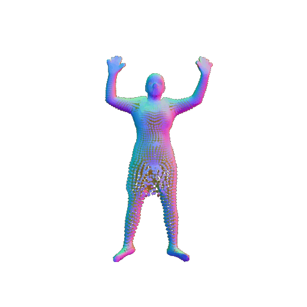
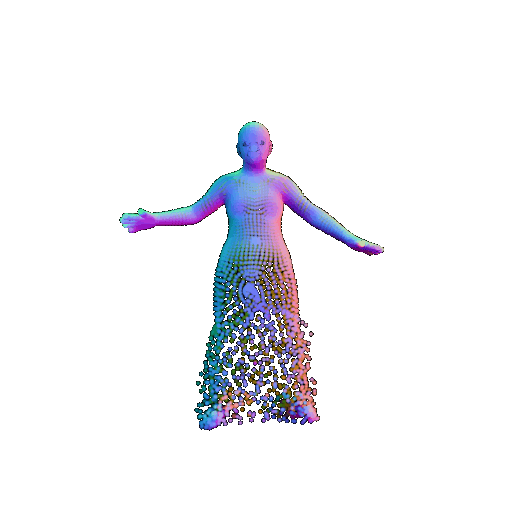

# SkiRT
SkiRT implementation

### Progress

##### 04/07

Wrote a simple coarse-stage network (according to the SkiRT paper section 4.1)

- Used the vertices of the SMPL-X model as input. Note that the point distribution in this case is not consistent across the body.
- Used 8 layers of MLP. Input: point position (dim=3) + global geometric feature (dim=256). Using local geometric feature for every point may potentially improve the result.
- Trained a separate network for every garment. It should also work when all the garments are trained together using only one network.

**Parameters**

```
lr: 5e-5
lr_geomfeat: 1e-4
batch_size: 8
num_samples: 10475 (SMPL-X number of vertices)
epoch: 250
```

**Coarse stage: Temp results**




**Problems**

The point cloud is too sparse using the vertices as input (and the density of point cloud is not consistent). Better approach: `sample_point_uniformly`. 

We can sample arbitrarily dense point cloud from the SMPL-X mesh, and perform interpolation to get the LBS weights of the sampled points. The problem is that this greatly slows down the training. 

**Next**

- fine stage network
- sparse point cloud -> dense point cloud: How?
- LBS weight field: is it really necessary?

https://github.com/xinyu-evolutruster/SkiRT